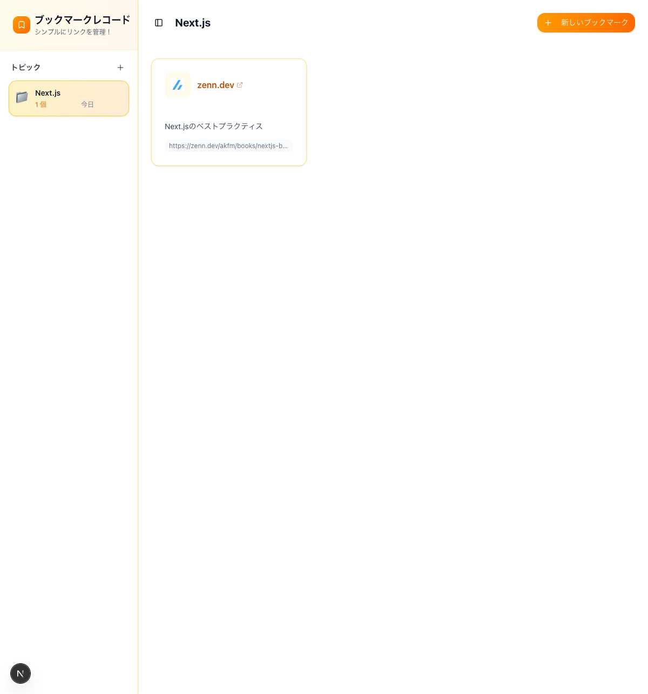

# ブックマーク管理アプリケーション



トピック（カテゴリ）別に Web ページのブックマークを整理・管理できるアプリケーションです。

## 概要

このアプリケーションは、Web ページのブックマークを効率的に管理するためのツールです。トピック（カテゴリ）を作成し、そのトピックに関連するブックマークを整理できます。

### 主な機能

- **トピック管理**: ブックマークを整理するためのカテゴリ（トピック）を作成・編集・削除
- **ブックマーク管理**: URL とコメントを含むブックマークの作成・編集・削除
- **階層的な整理**: トピックごとにブックマークを分類して管理
- **レスポンシブデザイン**: デスクトップとモバイルデバイスの両方に対応

### 使用技術

- **フロントエンド**: Next.js 15, React 19, TypeScript
- **スタイリング**: Tailwind CSS, Radix UI
- **データベース**: SQLite（Prisma ORM）
- **状態管理**: SWR
- **その他**: Lucide React（アイコン）、date-fns（日付処理）

## 技術仕様

このプロジェクトは [Next.js](https://nextjs.org) フレームワークを使用して構築されており、[`create-next-app`](https://nextjs.org/docs/app/api-reference/cli/create-next-app) でブートストラップされています。

## Getting Started

First, run the development server:

```bash
npm run dev
# or
yarn dev
# or
pnpm dev
# or
bun dev
```

Open [http://localhost:3000](http://localhost:3000) with your browser to see the result.

You can start editing the page by modifying `app/page.tsx`. The page auto-updates as you edit the file.

This project uses [`next/font`](https://nextjs.org/docs/app/building-your-application/optimizing/fonts) to automatically optimize and load [Geist](https://vercel.com/font), a new font family for Vercel.

## Learn More

To learn more about Next.js, take a look at the following resources:

- [Next.js Documentation](https://nextjs.org/docs) - learn about Next.js features and API.
- [Learn Next.js](https://nextjs.org/learn) - an interactive Next.js tutorial.

You can check out [the Next.js GitHub repository](https://github.com/vercel/next.js) - your feedback and contributions are welcome!

## Vercel にデプロイする

このアプリケーションを Vercel にデプロイするには、以下の手順に従ってください：

### 1. 前提条件

- GitHub リポジトリにプロジェクトをプッシュしておく
- Vercel アカウントを作成する

### 2. データベースの準備

現在のプロジェクトは SQLite を使用していますが、Vercel では永続化されません。本番環境では以下のいずれかを使用することをお勧めします：

- **Vercel Postgres**: Vercel が提供する PostgreSQL サービス
- **PlanetScale**: サーバーレス MySQL
- **Supabase**: オープンソースの PostgreSQL

### 3. Vercel でのデプロイ手順

1. [Vercel Dashboard](https://vercel.com/dashboard)にアクセス
2. "New Project"をクリック
3. GitHub リポジトリを選択
4. 環境変数を設定：
   - `DATABASE_URL`: 本番データベースの URL
5. "Deploy"をクリック

### 4. 環境変数の設定

Vercel ダッシュボードで以下の環境変数を設定してください：

```
DATABASE_URL=your-production-database-url
```

### 5. データベースの初期化

本番データベースを初期化するには、Vercel ダッシュボードのプロジェクト設定から以下のコマンドを実行してください：

```bash
npx prisma db push
```

### 注意事項

- 本番環境では、`prisma/schema.prisma`で SQLite から PostgreSQL に変更することを推奨します
- 環境変数は必ず Vercel ダッシュボードで設定してください
- データベースの変更を行う場合は、マイグレーションファイルを作成してください

詳細については、[Next.js deployment documentation](https://nextjs.org/docs/app/building-your-application/deploying) を参照してください。
